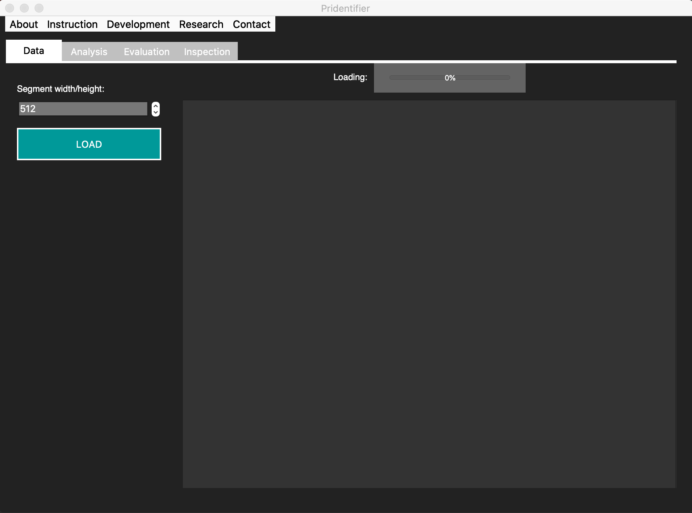

# Pridentifier  


This **Pridentifier** software was developed as research tool to investigate which printers (brand, model or individual) can be distinguished with the help of Fourier analysis features. But it can also be used for other classification problems of textual images. Feel free to investigate your textual classification problems with the Pridentifier.

The following image shows the 'fingerprints' (Fourier spectra) of 4 exemplary printers we used in our experiment. We examined one individual printer of each brand. Here we only name the brand, even if we examined indivuals of only one model. This repository contains a small test set of these 4 classes. 


**Disclaimer:** We can not tell for which printers, models or brands the classification works. This is only a research tool to find out by yourself. Therefore statistical relevant studies must be made to make good predictions.


## Installation

You should have installed miniconda. Then use conda to install a new environment from the *environment.yml*:

```bash
conda env create -f environment.yml
```

To activate the new environment type:

```bash
conda activate pridentifier
```

Then install the modules with:

```bash
python setup.py install 
```


## Run the Pridentifier 

To run the Pridentifier desktop application:

```bash
python pridentifier.py
```


## Support

For any questions if having problems with the installation or usage contact: trouble@korensic.com


## Roadmap

**App development**
- add functionality to make evaluation on an uploaded test-set
- save-button for evaluation results
- enable to analyze more than 8 classes (and make scrollable in GUI)
- enable tiff-formats


**Methods development**
- optimize feature selection with local maxima selection methods 

**GUI optimization**
- responsive design
- style menu bar 
- show also correlation value with all classes in the inspection

**Build process**
- integrate ui-generated python automatically in app by adding a inheritance object for additional changes made in app afterwards
- integrate windows exe-build to this repository


## Trouble shooting (because not fixed yet)
- change segment size several times, crashes or does not updates any more --> classes must be loaded again in the data-tab
- when clicking "save result" and then "cancel", the app crashes --> restart


## Contributing
Pull requests are welcome. For major changes, please open an issue first to discuss what you would like to change.

To contribute in the development of the Pridentifier type:

```bash
python setup.py develop 
```


## Usage

### Load data

In the Data tab of the Pridentifier, you can load the data of classes you want to analyze.



Select the top folder with one folder for each class (printer) with one or more images (prints) to load the train set. You can test it with the img/example/id-testset folder of this repository. 


After loading all images, the app tells you how much images it could find per class (printer) and into how many segments those could be split given the configured segment width/height before the data was loaded.


### Analyse 

In the Analysis tab of the Pridentifier, you can analyze the referenced data by clicking the Analyze button. You can configure the number of features to consider before analysing.


When the analysis is finished, the fingerprints of the classes (printers) are shown with its class names (labels). The fingerprints are the highest frequencies of the frequency spectrum. You can confiugre how many features are selected when setting the Feature size before starting the analysis.

### Evaluate 

In the Evaluation tab of the Pridentifier, you can evaluate the analysis by testing on the given data. It will tell you how good every segment used for the analysis (trainset) will be classified. For that, every segment will be inspected and classified as if its class was not known.


### Inspect

In the Inspection tab of the Pridentifier, you can inspect unknown prints or segments of prints.


After loading an unknown print, you must start the inspection. When finished, the results are shown in the table. The decissions are made for every segment on the test image.


## Authors

- Theresa Kocher (theresa@korensic.com)


## Acknowledgment
This Pridentifer application was developed in close collaboration with **Rolf Fauser** from the *Hochschule für Polizei Baden-Württemberg* in Germany. The research idea came into being at the *University for Applied Sciences Konstanz* within a studies project of **Theresa Kocher** and **Sabrina Hock**. This research project was supervised by **Prof. Dr. Matthias Franz** from the *Institute for Optical Systems* in Konstanz.

The *European Document Experts Working Group (EDEWG)* of the *European Network of Forensic Science Institutes (ENFSI)* have been supporting the development of the Pridentifier for years. Previous projects and partial results of the Pridentifer project were presented at their conferences in Ankara 2014, Frankfurt a. M. 2016 and in Lisbon 2018. In 2018 the EDEWG promoted the productive development of this Pridentifier which was only a prototype in a research context before. That's why as from now, the Pridentifer Application can be used as it is.

I'd like to say a big thank you to all institutions and persons given above.


## License
[MIT](https://choosealicense.com/licenses/mit/)


